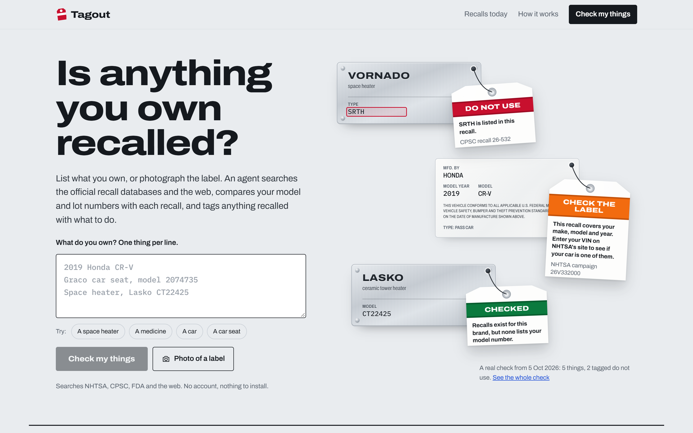
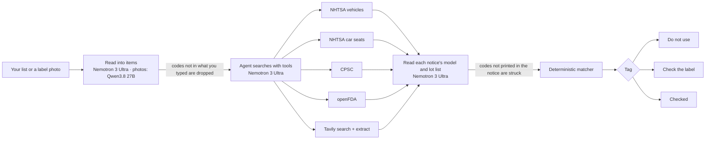
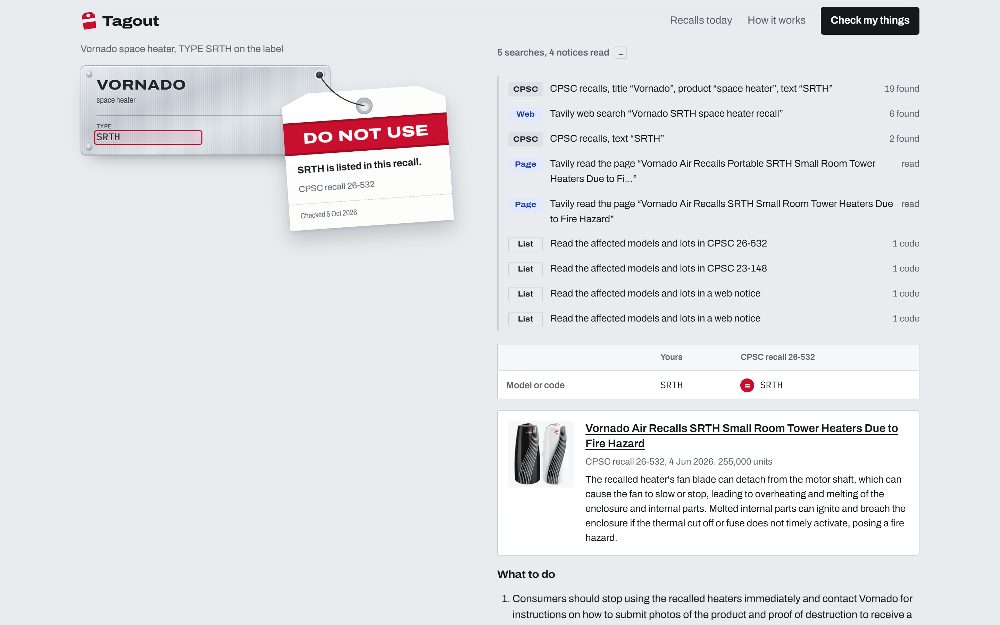
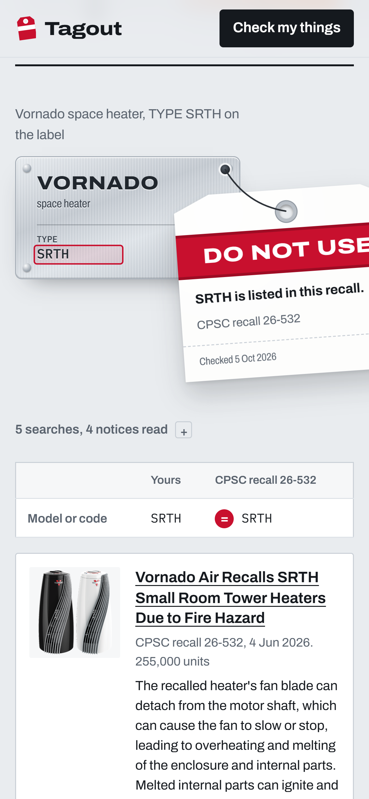

# Tagout

**Is anything you own recalled?** List what you own, or photograph the label. An agent on **NVIDIA Nemotron** (served by **Nebius Token Factory**) searches the official U.S. recall databases and the web, reads each recall's list of affected models and lots, and a deterministic matcher tags anything recalled, with what to do.

**Live:** https://tagout-recalls.vercel.app &nbsp;·&nbsp; **Demo video:** _link added at submission_



[](https://github.com/RohanGlitched/tagout/actions/workflows/ci.yml)


## Try it in one minute

1. Open https://tagout-recalls.vercel.app. No account, nothing to install.
2. Tap **A space heater** and **A medicine**, then **Check my things**.
3. Watch the agent search CPSC, the FDA and the web. Then the tags are hung: the Vornado heater (`TYPE SRTH`) and Tylenol lot `EJA022` are both **Do not use**, each with the recall's own line next to yours.
4. Try a car (`2019 Honda CR-V`) or a car seat with no model number (`Evenflo car seat`): both are **Check the label**, and the tag says exactly what to look up.
5. Or tap **Photo of a label** on your phone and photograph the rating plate of something you own.

Every check gets its own link, so you can send it to someone.

## Why

Agencies announce thousands of recalls a year: CPSC alone published 459 in 2026 by late September. Each sits in its own database, in its own words, and the deciding detail (a model number, a lot, a date window) is usually buried in a paragraph. People hear about the big ones on the news and miss the one for the heater under their desk. Tagout takes the list of things a household actually owns and does the looking.

## What happens in a check



1. **Read.** Nemotron turns each line into a kind of product, a brand and the codes a recall turns on (model, lot, VIN, UPC, NDC). Each code it returns must appear in what the person typed or it is dropped. VINs are decoded with NHTSA's vPIC. Label photos are read by Qwen3.8 27B on Token Factory (Token Factory has no NVIDIA vision model today).
2. **Search.** Nemotron 3 Ultra runs an agent loop with six tools: NHTSA vehicle recalls, NHTSA child-seat recalls, CPSC (SaferProducts.gov), openFDA enforcement reports, Tavily search and Tavily extract. It reads results and searches again with better words. For example, CPSC files a space heater under "tower heaters". It always runs a Tavily search too, because the databases trail the agencies' newsrooms by one to six weeks, and USDA FSIS is only reachable through the web. It finishes by naming the recalls that could cover the item. A few rules keep recalls the model may not drop: any notice containing the item's own code, and a brand's car-seat campaigns.
3. **Read the notices.** CPSC prints model numbers only in prose ("The model 'TYPE SRTH' is printed on the silver rating label"). Nemotron reads the affected models, lots, UPCs and date windows from each notice. Every code is then looked up in the notice's text, character for character; anything not printed there is struck, and the check says so.
4. **Match.** [`lib/match.ts`](lib/match.ts) compares the household's codes with each list, without a model. It handles exact codes, printed ranges (`2LC1234 through 2LC1240`), family codes (`5160X`), TYPE codes and manufacture-date windows. A near miss (`CT22425` vs `CT22425B`) is orange, never red. Cars are orange at most: NHTSA has no public per-VIN API, so the tag links to its VIN lookup.

The tags follow industrial lockout/tagout colours:

| Tag | Meaning |
|---|---|
| 🟥 **Do not use** | A code printed on your product is on the recall's list. Remedy and contact shown. |
| 🟧 **Check the label** | The product line is recalled; yours isn't confirmed either way. The tag says where the code is printed. |
| 🟩 **Checked** | No recall lists it on the day of the check; the sources searched are named. |

## How Nemotron and Nebius Token Factory are used

All model calls go to **Nebius Token Factory**'s OpenAI-compatible API (`https://api.tokenfactory.nebius.com/v1`) from [`lib/nebius.ts`](lib/nebius.ts).

| Role | Model | How |
|---|---|---|
| Read the household's list | `nvidia/Nemotron-3-Ultra-550b-a55b` | Strict `json_schema` output; every code verified against the input |
| Search agent | `nvidia/Nemotron-3-Ultra-550b-a55b` | OpenAI-style `tools`, parallel tool calls, up to 6 rounds, forced `finish` on the last |
| Read each recall notice | `nvidia/Nemotron-3-Ultra-550b-a55b` | Strict `json_schema`; codes verified against the notice text |
| Fallback for all three | `nvidia/nemotron-3-super-120b-a12b` | Same calls; used when Ultra errors or times out |
| Read label photos | `Qwen/Qwen3.8-27B`, then `zai-org/GLM-5.3-Flash` | Vision chat with `json_schema` |

Why Ultra everywhere: on day one we measured all four Nemotron models on Token Factory with the same tool call and the same strict-JSON task. Ultra was the fastest *and* the cleanest (0.5 s for a tool call, 0.9 s for structured output). Super sometimes leaked reasoning into JSON strings, which the code verifier caught and struck. The model chain is set by env (`NEBIUS_AGENT_MODELS`, `NEBIUS_READER_MODELS`, `NEBIUS_VISION_MODELS`), and the page names the model that actually answered.

If Token Factory is unreachable, or the demo's daily budget (`DAILY_MODEL_CAP`) is spent, checks run a fixed search plan with the same matcher, and say so.

## How Tavily is used

[`lib/sources/web.ts`](lib/sources/web.ts) calls Tavily at runtime on every check:
- **Search**, limited to `cpsc.gov`, `nhtsa.gov`, `fda.gov`, `fsis.usda.gov`, `recalls.gov` and `foodsafety.gov`, plus a maker's domain when the agent asks for one. It catches recalls newer than the databases (CPSC's newsroom was a week ahead of its API on Oct 5, 2026), and USDA FSIS, whose API blocks automated clients.
- **Extract**, to read a recall page in full when the snippet doesn't show which models or lots are affected.
- A `cpsc.gov` result is swapped for CPSC's own database record when one exists, so tags cite recall numbers.

## Data sources

| Source | Endpoint | Used for |
|---|---|---|
| NHTSA vPIC | `vpic.nhtsa.dot.gov/api/vehicles/DecodeVinValues` | VIN → make, model, year |
| NHTSA recalls | `api.nhtsa.gov/recalls/recallsByVehicle`, `api.nhtsa.gov/childSeats/bySearch` | Vehicle and child seat recalls, "do not drive" flags |
| CPSC | `saferproducts.gov/RestWebServices/Recall`, CPSC recalls RSS | Consumer products |
| FDA | `api.fda.gov/{drug,food,device}/enforcement.json` | Drugs, food and supplements, medical devices |
| Tavily | `api.tavily.com/search`, `/extract` | The newest recalls, USDA FSIS, full recall pages |

All are public and keyless except Tavily and Token Factory.

## Screens

| Check with the agent's log | Phone |
|---|---|
|  |  |

## Run it

```bash
npm install
cp .env.example .env.local   # add NEBIUS_API_KEY and TAVILY_API_KEY
npm run dev                  # http://localhost:3000
```

Checks are stored as JSON under `.data/` locally, or in a private Vercel Blob store when `BLOB_READ_WRITE_TOKEN` is set.

```bash
npm test           # matcher unit tests
npm run typecheck
npx tsx --conditions=react-server scripts/try-check.ts "Vornado heater TYPE SRTH\n2019 Honda CR-V"   # one check in the terminal
```

## Code map

| Path | What |
|---|---|
| `lib/agent/intake.ts` | List and photo → items; typed-code verification; fixed parser fallback |
| `lib/agent/investigate.ts` | The Nemotron tool loop, tool runners, must-keep rules, fixed plan |
| `lib/agent/read-notice.ts` | Reads model/lot lists from a notice and strikes codes it doesn't print |
| `lib/match.ts` | The deterministic matcher (tested in `test/match.test.ts`) |
| `lib/agent/verdict.ts` | Tag, headline and steps from the match |
| `lib/agent/run.ts` | One check as an event stream (NDJSON to the page) |
| `lib/sources/*` | NHTSA, CPSC, openFDA and Tavily clients, with the quirks measured on day one |
| `components/label`, `components/tag` | Product labels (rating plate, door-jamb sticker, car seat label, carton) and the lockout tags |

## Honest notes

- U.S. recalls only. A product sold only elsewhere may be recalled there without a U.S. notice.
- Green means nothing was found that day, not that a product is safe.
- CPSC's API returns a fake error record and caches it per URL, so every call carries a cache-buster and retries. Its `Model` field is always empty, which is why model numbers are read from the prose.
- The demo has per-visitor and daily limits on model calls; past them, checks use the fixed plan.
- Tagout isn't affiliated with NHTSA, CPSC, FDA or USDA. Always confirm with the recall notice; every tag links to it.

## License

MIT. See [LICENSE](LICENSE).
