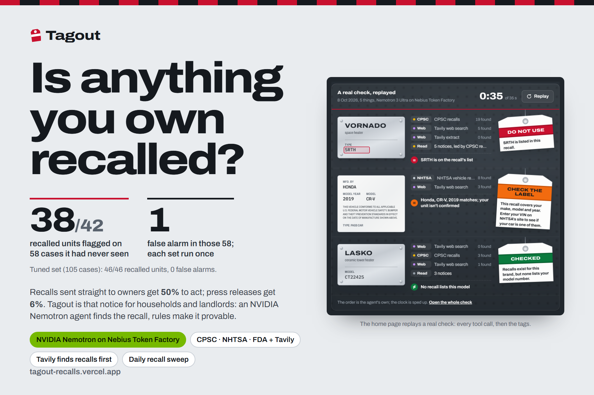
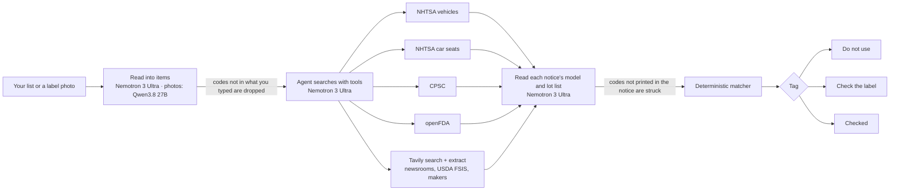
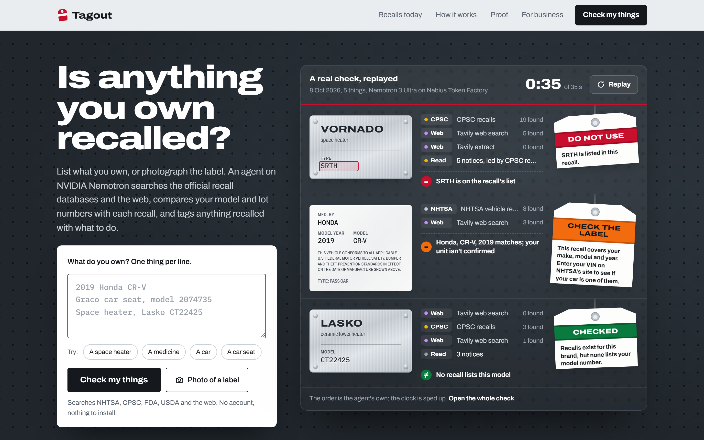
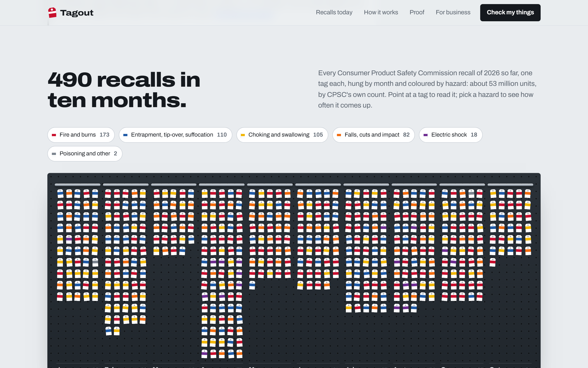
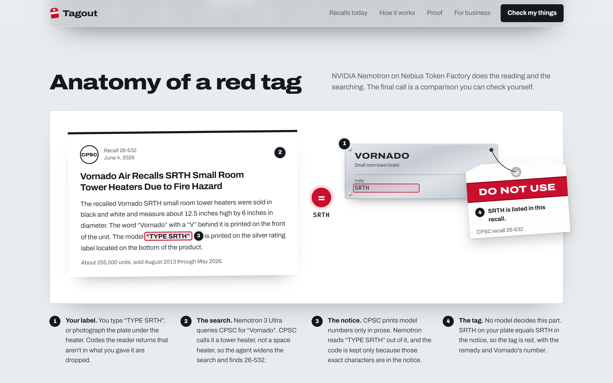
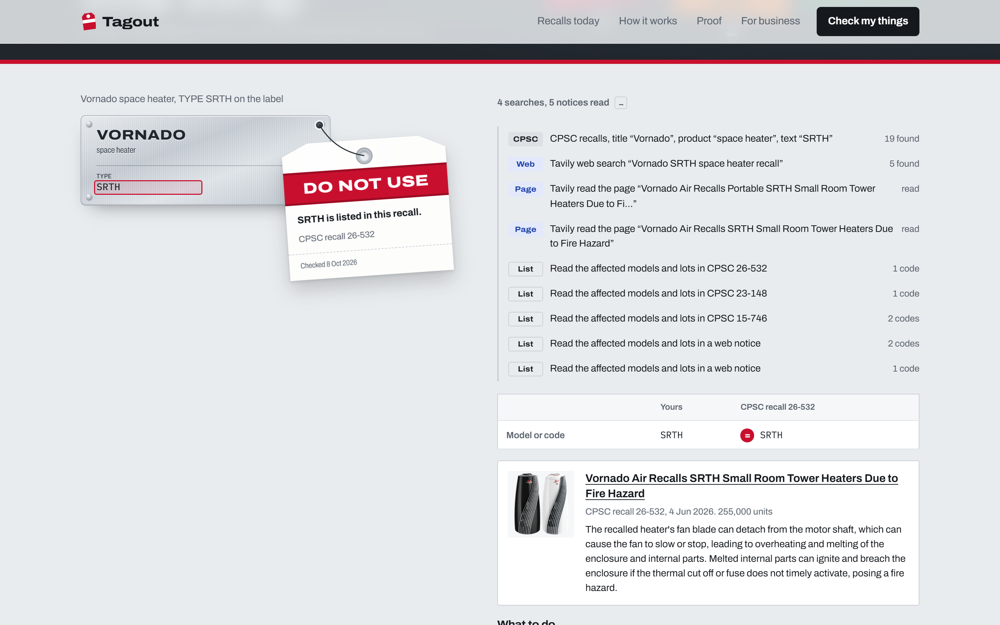
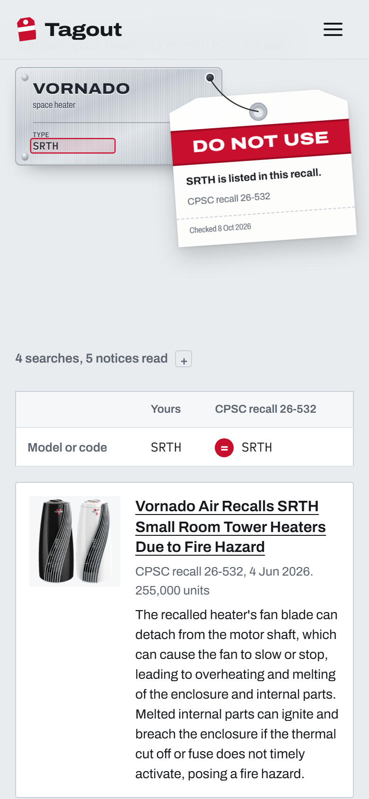

<div align="center">



<br>

[](https://github.com/RohanGlitched/tagout/actions/workflows/ci.yml)
[](#how-nemotron-and-nebius-token-factory-are-used)
[](#how-tavily-is-used)
[](#results-105-real-cases)
[](#data-sources)
[](LICENSE)

**[Try it live](https://tagout-recalls.vercel.app)** · **[A finished check](https://tagout-recalls.vercel.app/check/kj6iutme8c)** · **[The eval](https://tagout-recalls.vercel.app/proof)** · **[A watched household](https://tagout-recalls.vercel.app/watch/5ehharz7sr)** · **[How it works](https://tagout-recalls.vercel.app/how)**

<!-- TODO(video): swap in the public YouTube URL once the video is set to Public or re-uploaded -->
**Demo video:** https://youtu.be/YVw1EcY3eVU (2:31)

</div>

---

**On 105 real recall cases, Tagout tagged all 46 recalled units Do not use and wrongly told nobody to stop using something. NVIDIA Nemotron 3 Ultra on its own caught 5 of the 46, cleared 36, and told five people to stop using things no recall lists.**

Tagout checks what a household owns against live U.S. recalls. List what you own, or photograph the label. An agent on **NVIDIA Nemotron** (served by **Nebius Token Factory**) searches NHTSA, CPSC and the FDA with tools, and **Tavily** searches the agencies' newsrooms and USDA for anything the databases don't have yet. Nemotron reads each notice's list of affected models and lots, every code is checked against the notice's own text, and plain rules hang the tag. Save the list as a watch and Tagout checks it again each time you open the link, with what's new.

## Try it in one minute

1. Open https://tagout-recalls.vercel.app. No account, nothing to install.
2. Tap **A space heater** and **A medicine**, then **Check my things**.
3. Watch the agent search CPSC, the FDA and the web (about 25 seconds an item). Then the tags are hung: the Vornado heater (`TYPE SRTH`) and Tylenol lot `EJA022` are both **Do not use**, each with the recall's own line next to yours.
4. Try a car (`2019 Honda CR-V`) or a car seat with no model number (`Evenflo car seat`): both are **Check the label**, and the tag says exactly what to look up.
5. At the bottom of a finished check, **Watch these things** saves the list. [This watch](https://tagout-recalls.vercel.app/watch/5ehharz7sr) started from the Oct 8 showcase and was checked again on Oct 15.
6. The [eval](https://tagout-recalls.vercel.app/proof) shows every case and every answer, including the ones that were wrong.

Every check gets its own link, so you can send it to someone.

## Why

CPSC alone announced 479 recalls in 2026 by Oct 8; the FDA and NHTSA add thousands more. Each sits in its own database, in its own words, and the deciding detail (a model number, a lot, a date window) is usually buried in a paragraph. CPSC's own staff measured what that costs: recalls announced only by press release got **6%** of consumers to act, while recalls sent straight to owners got **50%** ([CPSC Recall Effectiveness Workshop, recall data, closed cases FY2013–2016](https://www.slideshare.net/slideshow/cpsc-recall-effectiveness-workshop-recall-data/78744492)). Tagout takes the list of things a household actually owns, does the looking, and keeps looking.

## Results: 105 real cases

Cases come from 2025–26 CPSC recalls, openFDA enforcement reports and NHTSA's recall API: 46 units whose code is printed in a recall, 27 near misses (a neighbouring lot or model, a date outside the window), 12 recalled product lines with no code given, 12 cars and 8 things no recall lists. [`eval/verify.mjs`](eval/verify.mjs) checks every expected answer against the agency's own record without any Tagout code. All 105 verify.

| Arm | Right | Wrongly told to stop using | Recalled, but cleared | Red tags right | Recalled units caught | Cost per item |
|---|---|---|---|---|---|---|
| **Tagout** (Ultra reads the list, runs the agent, reads the notices; rules decide) | **104/105** | **0** | **0** | 100% (46/46) | 100% (46/46) | 2.6¢ |
| Nemotron 3 Ultra reading Tavily's results, no rules | 75/105 | 5 | 12 | 85% (29/34) | 63% (29/46) | 0.32¢ |
| Nemotron 3 Ultra alone, no tools | 45/105 | 5 | 36 | 50% (5/10) | 11% (5/46) | 0.26¢ |
| Fixed search plan, Nano reads the notices (the lite tier) | 98/105 | 1 | 0 | 98% (45/46) | 98% (45/46) | 0.29¢ |
| No model at all (fixed plan, pattern reader, rules) | 87/105 | 2 | 10 | 95% (37/39) | 80% (37/46) | 0¢ |

- **Nemotron alone invents recalls.** All five of its wrong red tags cite a recall number and a reason, such as "CPSC 23-231, Model 53101-209 is explicitly listed" for a ZWILLING kettle that recall doesn't list. Tagout's rules can't do that: red needs your code printed in the notice.
- **The first run was worse, and it says so.** The first full run got 98 of 105: 2 units wrongly red and 2 recalled units cleared. Each miss was traced and fixed in code with a unit test (a lot list cut short at its first group, a date code, a one-sided date window, an FDA page replacing a record's text, a brand field openFDA leaves empty, a trailing X read as a wildcard). One expected answer was wrong and was corrected: a Jan 2026 recall covers all lots of one distributor's Claritin. The numbers above are measured on cases that shaped those fixes; the first run is the fairer estimate for new ones. Both are on [/proof](https://tagout-recalls.vercel.app/proof).
- **Where the agent earns its place.** With the same rules, the fixed search plan is nearly as safe on red tags but sends more needless "check the label" tags on things nobody recalled (3 of 8 right vs 7 of 8), and costs a ninth as much. So it became the fallback, not the default.
- **Limits.** One run per arm, not an average. We picked the cases. Recalled units come from notices that print a code; a recall that prints none can only ever be orange.

Reproduce it (every HTTP response is cached, so a re-run reads the same data and costs nothing):

```bash
node eval/verify.mjs                                          # ground truth against the agencies
npx tsx --conditions=react-server eval/run.ts tagout          # one arm; also alone-ultra, search-ultra, fixed-plan-nano, rules, ...
node eval/score.mjs                                           # eval/summary.json and the table above
node eval/spend.mjs                                           # what the eval spent on Token Factory
```

The whole eval, including the runs thrown away while the harness was fixed, cost $4.66 of Token Factory tokens.

## What happens in a check


```mermaid
flowchart LR
  A[Your list or a label photo] --> B[Read into items<br/>Nemotron 3 Ultra · photos: Qwen3.8 27B]
  B -->|codes not in what you typed are dropped| C[Agent searches with tools<br/>Nemotron 3 Ultra]
  C --> D1[NHTSA vehicles]
  C --> D2[NHTSA car seats]
  C --> D3[CPSC]
  C --> D4[openFDA]
  C --> D5[Tavily search + extract<br/>newsrooms, USDA FSIS, makers]
  D1 & D2 & D3 & D4 & D5 --> E[Read each notice's model and lot list<br/>Nemotron 3 Ultra]
  E -->|codes not printed in the notice are struck| F[Deterministic matcher]
  F --> G{Tag}
  G --> R[Do not use]
  G --> O[Check the label]
  G --> K[Checked]
```

1. **Read.** Nemotron turns each line into a kind of product, a brand and the codes a recall turns on (model, lot, VIN, UPC, NDC). Each code it returns must appear in what the person typed or it is dropped. VINs are decoded with NHTSA's vPIC. Label photos are read by Qwen3.8 27B on Token Factory, with Gemma 3 27B as its fallback (Token Factory has no NVIDIA vision model today).
2. **Search.** Nemotron 3 Ultra runs an agent loop with six tools: NHTSA vehicle recalls, NHTSA child-seat recalls, CPSC (SaferProducts.gov), openFDA enforcement reports, Tavily search and Tavily extract. It reads results and searches again with better words (CPSC files a space heater under "tower heaters"). It always runs a Tavily search too, because the databases trail the agencies' newsrooms by one to six weeks, and USDA FSIS is only reachable through the web. A few rules keep recalls the model may not drop: any notice containing the item's own code, a brand's car-seat campaigns, and a brand's FDA recalls of the product when no lot was given.
3. **Read the notices.** CPSC prints model numbers only in prose ("The model 'TYPE SRTH' is printed on the silver rating label"). Nemotron reads the affected models, lots, UPCs and date windows from each notice. Every code is then looked up in the notice's text, character for character; anything not printed there is struck, and the check says so.
4. **Match.** [`lib/match.ts`](lib/match.ts) compares the household's codes with each list, without a model: exact codes, printed ranges (`2LC1234 through 2LC1240`), family codes (`5160X`, in model lists only), TYPE codes and manufacture-date windows, open at one end or both. When the reader's list missed a code that the notice's own text prints, the text wins. A near miss (`CT22425` vs `CT22425B`), or a model match when the recall is limited to date codes that yours isn't, is orange, never red. Cars are orange at most: NHTSA has no public per-VIN API, so the tag links to its VIN lookup.

The tags follow industrial lockout/tagout colours:

| Tag | Meaning |
|---|---|
| 🟥 **Do not use** | A code printed on your product is on the recall's list. Remedy and contact shown. |
| 🟧 **Check the label** | The product line is recalled; yours isn't confirmed either way. The tag says where the code is printed. |
| 🟩 **Checked** | No recall lists it on the day of the check; the sources searched are named. |

## How Nemotron and Nebius Token Factory are used

All model calls go to **Nebius Token Factory**'s OpenAI-compatible API (`https://api.tokenfactory.nebius.com/v1`) from [`lib/nebius.ts`](lib/nebius.ts).

| Role | Model | How | Measured alternative |
|---|---|---|---|
| Read the household's list | `nvidia/Nemotron-3-Ultra-550b-a55b` | Strict `json_schema`; every code verified against the input | Super filed 11 of 105 eye drops and foods as products (the wrong database); Nano dropped a car's year |
| Search agent | `nvidia/Nemotron-3-Ultra-550b-a55b` | OpenAI-style `tools`, parallel tool calls, up to 6 rounds, forced `finish` on the last | On 18 cases, Super was right on 17 at half the cost and Nano on 15: too few to move the agent |
| Read each recall notice | `nvidia/Nemotron-3-Ultra-550b-a55b` | Strict `json_schema`; codes verified against the notice text | Super: 1 unit wrongly red; Nano: 2 |
| Lite tier notice reader | `nvidia/NVIDIA-Nemotron-3-Nano-30B-A3B` | With the fixed search plan, once the day's Ultra budget is spent | 98 of 105 right, none cleared, 0.29¢ an item |
| Fallback for every role | `nvidia/nemotron-3-super-120b-a12b` | Same calls; used when the first model errors or times out | |
| Read label photos | `Qwen/Qwen3.8-27B`, then `google/gemma-3-27b-it` | Vision chat with `json_schema` | |

The track asks for Ultra where reasoning is hard and Nano or Super for the everyday calls. We measured each size in each role and kept Ultra where a cheaper model made a mistake that matters (a wrong red tag, a medicine searched in the wrong database). Where Nano held up, it now runs: when the demo's daily Ultra allowance is spent, checks drop to the **lite tier** (fixed plan plus Nano reading the notices, about a ninth of the cost), where they used to drop to no model at all (87 of 105, 10 recalled units cleared). Past the lite allowance too, the rules-only plan still runs, and the page says which tier a check used.

A full check costs about **2.6¢ an item**; the five-item showcase took 37 Token Factory calls and about 114k tokens. Each finished check reports its own calls and tokens under "How this check ran". Model chains are set by env (`NEBIUS_AGENT_MODELS`, `NEBIUS_READER_MODELS`, `NEBIUS_INTAKE_MODELS`, `NEBIUS_LITE_READER_MODELS`, `NEBIUS_VISION_MODELS`).

## How Tavily is used

[`lib/sources/web.ts`](lib/sources/web.ts) calls Tavily at runtime on every check:
- **Search**, limited to `cpsc.gov`, `nhtsa.gov`, `fda.gov`, `fsis.usda.gov`, `recalls.gov` and `foodsafety.gov`, plus a maker's domain when the agent asks for one. It catches recalls newer than the databases (CPSC's newsroom runs about a week ahead of its API) and USDA FSIS meat and poultry recalls, whose API turns away automated clients.
- **Extract**, to read a recall page in full when the snippet doesn't show which models or lots are affected.
- A `cpsc.gov` page that CPSC's database also has is swapped for the database record, so tags cite recall numbers. The log says so: "Tavily web search … 6 found, 2 new" means four pages confirmed recalls already found and two added new ones.
- A recall that only Tavily found carries a badge on the tag: **Ahead of the database** when CPSC's database didn't have it on the day of the check, **Found by Tavily** otherwise (with the USDA note for FSIS recalls).
- In the eval, the Vornado heater's red tag came from the CPSC newsroom page Tavily found, after the database record's own text failed to give up the code.

## Watch mode

**Watch these things**, under any finished check, saves the typed list (photos aren't kept) and gives it a link. Opening that link checks the list again if the newest check is more than a day old, then shows **what changed since the last check**: a tag that got worse or better, a recall published since then, a thing checked for the first time. Nothing runs in the background and nothing is emailed yet; there is no scheduler, so a watch moves only when someone opens it, at most once a day, under the same budget as any check. The browser remembers your watches on the home page.

## Who pays

Households use it free. The people who lose money when a recall doesn't reach an owner would pay to run it for their customers:
- **Home, renters and auto insurers, and home-warranty firms**: a recalled heater or dryer is a claim waiting to happen. They already hold the list of insured items.
- **Property managers**: appliances in every unit, one watch per building.
- **Baby-registry retailers and pediatric practices**: car seats, bassinets and formula are where recalls hit hardest, and they know what was bought.
- **The recalling firms**: CPSC's own numbers say direct contact moves consumer response from 6% to 50%, and a watch is direct contact the owner set up.

At 2.6¢ an item for a full check (0.29¢ on the lite tier), checking a 20-item household every month costs about $6 a year on the full tier, or 70¢ on the lite tier.

## Data sources

| Source | Endpoint | Used for |
|---|---|---|
| NHTSA vPIC | `vpic.nhtsa.dot.gov/api/vehicles/DecodeVinValues` | VIN → make, model, year |
| NHTSA recalls | `api.nhtsa.gov/recalls/recallsByVehicle`, `api.nhtsa.gov/childSeats/bySearch` | Vehicle and child seat recalls, "do not drive" flags |
| CPSC | `saferproducts.gov/RestWebServices/Recall`, CPSC recalls RSS | Consumer products |
| FDA | `api.fda.gov/{drug,food,device}/enforcement.json` | Drugs, food and supplements, medical devices (an optional `OPENFDA_API_KEY` raises the per-IP limit) |
| Tavily | `api.tavily.com/search`, `/extract` | The newest recalls, USDA FSIS, full recall pages |

All are public and keyless except Tavily and Token Factory.

## Screens

**The home page**: a real check pinned to the pegboard, one tag per thing.



**Every CPSC recall of 2026, one tag each**, by month and hazard (live, on the home page):



**Anatomy of a red tag:** the notice's own wording, the code read from it, the same code on the plate.



| Check with the agent's log | Phone |
|---|---|
|  |  |

## Run it

```bash
npm install
cp .env.example .env.local   # add NEBIUS_API_KEY and TAVILY_API_KEY
npm run dev                  # http://localhost:3000
```

Checks and watches are stored as JSON under `.data/` locally. In production they live in a private Google Cloud Storage bucket, reached keylessly: the function's Vercel OIDC token is exchanged for a Google access token through a workload identity pool (`GCS_BUCKET`, `GCS_WIF_AUDIENCE`), so no key exists anywhere. A Vercel Blob store (`BLOB_READ_WRITE_TOKEN`) also works; it was the first store, until the Hobby account's shared monthly Blob allowance ran out on Oct 8. See [`lib/storage.ts`](lib/storage.ts).

```bash
npm test           # matcher, watch and web-filter unit tests (25)
npm run typecheck
npx tsx --conditions=react-server scripts/try-check.ts "Vornado heater TYPE SRTH\n2019 Honda CR-V"   # one check in the terminal
```

## Code map

| Path | What |
|---|---|
| `lib/agent/intake.ts` | List and photo → items; typed-code verification; fixed parser fallback |
| `lib/agent/investigate.ts` | The Nemotron tool loop, tool runners, must-keep rules, fixed plan |
| `lib/agent/read-notice.ts` | Reads model/lot lists and date windows from a notice and strikes codes it doesn't print |
| `lib/match.ts` | The deterministic matcher (tested in `test/match.test.ts`) |
| `lib/agent/verdict.ts` | Tag, headline and steps from the match |
| `lib/agent/run.ts` | One check as an event stream (NDJSON to the page); full or lite tier |
| `lib/budget.ts` | Per-visitor and daily allowances for the full and lite tiers |
| `lib/watch.ts`, `lib/watches.ts` | Watches and what changed between two checks (tested in `test/watch.test.ts`) |
| `lib/sources/*` | NHTSA, CPSC, openFDA and Tavily clients, with the quirks measured on day one |
| `eval/` | Cases, ground-truth check, cached harness, scorer, results ([/proof](https://tagout-recalls.vercel.app/proof)) |
| `components/label`, `components/tag` | Product labels (rating plate, door-jamb sticker, car seat label, carton) and the lockout tags |

## Honest notes

- U.S. recalls only. A product sold only elsewhere may be recalled there without a U.S. notice.
- Green means nothing was found that day, not that a product is safe.
- CPSC's API returns a fake error record and caches it per URL, so every call carries a cache-buster and retries. Its `Model` field is always empty, which is why model numbers are read from the prose.
- The demo has per-visitor and daily limits on model calls: 12 checks per 10 minutes and 15 a day per address on the full tier, 60 a day in all (`IP_DAILY_MODEL_CAP`, `DAILY_MODEL_CAP`); then 30 and 120 on the lite tier (`IP_DAILY_LITE_CAP`, `DAILY_LITE_CAP`); past both, the rules-only plan.
- The vision fallback changed on Oct 5: GLM-5.3-Flash took over three minutes to answer a one-line prompt, so Gemma 3 27B (7 s on the sample label) now backs up Qwen3.8 27B.
- Tagout isn't affiliated with NHTSA, CPSC, FDA or USDA. Always confirm with the recall notice; every tag links to it.

## License

MIT. See [LICENSE](LICENSE).
